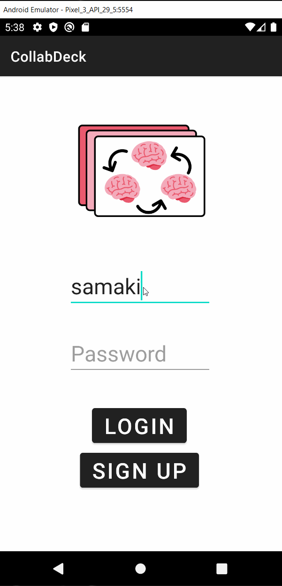
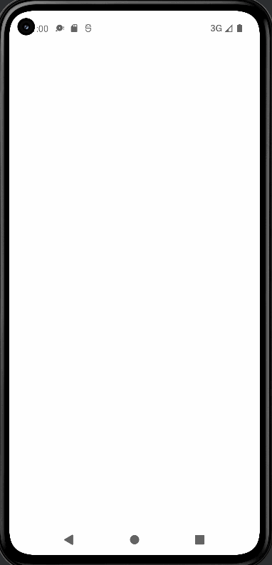
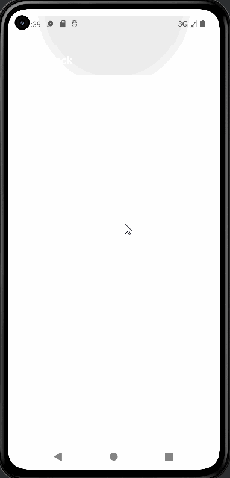
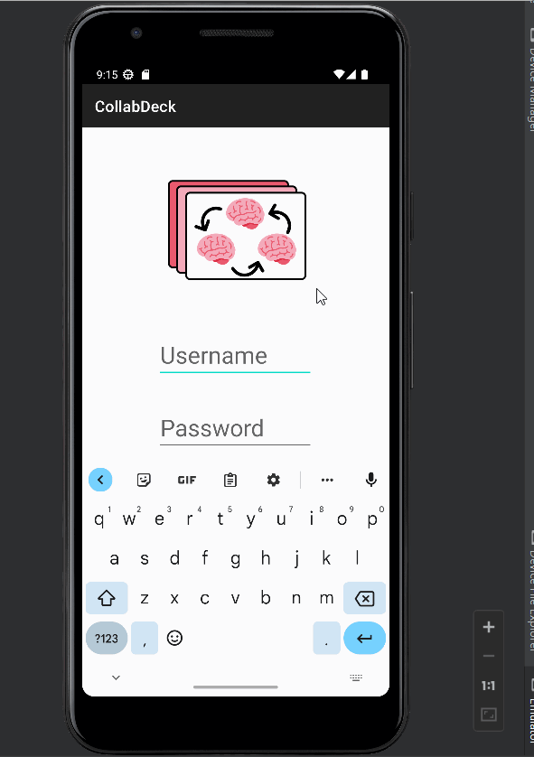

Original App Design Project - README
===

# CollabDeck

## Table of Contents
1. [Overview](#Overview)
1. [Product Spec](#Product-Spec)
1. [Wireframes](#Wireframes)
1. [Schema](#Schema)

## Overview
### Description
Our app lets registered users create sets of terms and definitions customized for their own needs. Users can work together in the same set in real time and leave comments on specific term.

### App Evaluation
[Evaluation of your app across the following attributes]
- **Category:** Education
- **Mobile:** This app can be used as a mobile app or on a computer, with similiar features. However, students are more likely to use the mobile app when they are on the go.
- **Story:** Users are able to study together with their friends online and respond to each others questions, as well as motivate eachother through friendly competition.
- **Market:** Essentially anyone can use the app and customize to their needs. Students will be able to collaborate and study together. Teachers will be able to create study sets for their students. Parents will be able to create study sets for their kids.
- **Habit:** This app is likely to be used often by students, or simply anyone who likes to learn. Studying will also be gamified in this app by allowing collaborators to have a level of competition through adding a self-reported leaderboard for students to quiz themselves.
- **Scope:** First, we would start with letting users study together and test themselves with flashcards. We will add a way for users to mark the number of cards that they got right or wrong when quizzing themselves and populate a high score board, so all collaborators on a set of cards have a way of seeing eachothers' performance and will try to compete.

## Product Spec

### 1. User Stories (Required and Optional)

**Required Must-have Stories**

- [x] User can sign up to create a new account using Parse authentication
- [x] User can log in and log out of his or her account
- [x] The current signed in user is persisted accross app restarts
- [x] Upon login, user can view all sets
- [x] User can create study set and add flashcards
- [x] User can add collaborators to study set
- [x] User can edit flashcards
- [x] User can test themselves with term, definition, or both
- [x] User can mark whether they got a correct or incorrect term/definition when quizzing themself
- [x] Correct answer reports from the user will update a tally as they run through the set of flashcards.
- [x] Tallies of correct answers (scores) as well as the associated user will be present on a leaderboard page which can be accessed from the flashcard set.
- [x] User can comment on flashcard
- [x] User can view all comments in study set/flashcards
- [x] Profile page with options to edit profile picture, and logout
- [x] Settings (logout, delete account)
- [x] User can update their profile image from their photo gallery or by taking a picture with their camera

**Optional Nice-to-have Stories**

- [x] After the user creates a study set, show an indeterminate progress bar while the set is being uploaded to Parse.
- [ ] User can create class, add classmates who are automatically added to study sets created in class
- [ ] User can create folder, add study sets to folder
- [ ] Settings (offline studying)

### 2. Screen Archetypes

* Register
   * User can sign up to create a new account using Parse authentication
* Login
   * User can log in and log out of his or her account
   * The current signed in user is persisted accross app restarts
* Stream
   * Upon login, user can view all sets
   * User can view each collaborator's top score in study set
   * User can view all comments in flashcard/study set
* Detail
   * User can add collaborators to study set
   * User can edit flashcards
   * User can test themselves with term, definition, or both
* Creation
   * User can create study set and add flashcards
   * User can comment on flashcard
* Profile
   * Profile page to see user's profile picture, edit profile, or logout
   
* Settings
   * Settings (logout, delete account)

### 3. Navigation

**Tab Navigation** (Tab to Screen)

* Home
* Create
* Profile
* Settings

**Flow Navigation** (Screen to Screen)

* Landing Page -> Click on Register/Login button -> Home screen
* Home -> Click on flashcard set -> Set View screen
* Home -> Click on Logout Button -> Logout Screen
* Home -> Click on New Set button -> Create Blank Set screen
* Home -> Click on Profile button -> Profile screen
* Home -> Click on Settings button -> Settings screen
* Settings -> Click on Delete Account button -> Delete Account screen
* Profile -> Click on Edit Profile button -> Edit Profile screen
* Edit Profile -> Click Open Camera/Open Gallery button -> Opens the phone's Camera/Photo Gallery
* Set View -> Click on flashcard/Test Mode button -> Front of Card screen
* Set View -> Click on Leaderboard (star) button -> Leaderboard screen
* Set View -> Click on Add Card button -> Edit/Compose card screen
* Set View -> Click on Collaborators button -> Invite Collaborators screen
* Front of card -> Click on Flip Card button -> Back of Card screen
* Front of card -> Click on Comments button -> Flashcard Comments screen
* Front of card -> Click on Edit Card button -> Edit/Compose Card screen
* ('Front of Card' and 'Back of Card' screens share the same functionalities)
* Comments screen -> Click on Add Comment button -> Compose Comment screen

## Video Walkthrough

Here's a walkthrough of implemented user stories:

### Sprint 1

<br>

GIF created with [LiceCap](http://www.cockos.com/licecap/).

### Sprint 2

<br>

GIF created with [LiceCap](http://www.cockos.com/licecap/).

### Sprint 3

<br>

GIF created with [LiceCap](http://www.cockos.com/licecap/). 


### Sprint 4

<br>

GIF created with [LiceCap](http://www.cockos.com/licecap/).


## Wireframes


### [BONUS] Digital Wireframes & Mockups


### [BONUS] Interactive Prototype


## Schema 
[This section will be completed in Unit 9]
### Models
Users
|Property|Type|Description|
|-|-|-|
|username|String|unique id set by each user|
|email|String|email set by user|
|password|String|password set by user|

StudySet
|Property|Type|Description|
|-|-|-|
|setId|String|unique id for the study set (default)|
|setName|String|set name|
|username|Array of Pointer to User|study set collaborators|

FlashCard
|Property|Type|Description|
|-|-|-|
|cardId|String|unique id for the flashcard (default)|
|setId|Pointer to StudySet|StudySet setId|
|term|String|term|
|definition|String|definition|

Comments
|Property|Type|Description|
|-|-|-|
|commentId|String|unique id for the comment (default)|
|cardId|Pointer to FlashCard|FlashCard cardId|
|username|Pointer to user|User id|
|comment|String|comment|

LeaderBoard
|Property|Type|Description|
|-|-|-|
|leaderBoardId|String|unique id for the leaderboard (default)|
|setId|Pointer to StudySet|StudySet setId|
|userName|Pointer to User|User id|
|score|int|score user got while self testing|

### Networking
List of network requests by screen
- Home
  - (Read/GET) Query all study sets associated with user
  ```kotlin
  val query : ParseQuery<StudySet> = ParseQuery.getQuery(StudySet::class.java)
  query.include("username")
  query.addDescendingOrder("createdAt")
  query.findInBackground(object : FindCallback<StudySet> {
      override fun done(studySetList: MutableList<StudySet>?, e: ParseException?) {
          if (e != null) {
              Log.e("ACTIVITY" , "queryPosts failure ${e}")
          } else {
              Log.e("ACTIVITY", "queryPosts success")
              }
          }
      }
  })
  ```
- Set View
  - (Create/STUDYSET) Create a new study set
  ```kotlin
  val set = StudySet()
  set.addCollaborator(user)
  set.setSetName(setName)
  set.saveInBackground { exception ->
      if (exception != null) {
          Log.d("ACTIVITY" , "set create failure ${exception}")
      } else {
          Log.d("ACTIVITY" , "set create success")
      }
  }
  ```
  - (READ/GET) Get flashcards in set
  ```kotlin
  val query : ParseQuery<FlashCard> = ParseQuery.getQuery(FlashCard::class.java)
  query.include("term")
  query.include("definition")
  query.whereEqualTo("setId", set.objectId);
  query.addDescendingOrder("createdAt")
  query.findInBackground(object : FindCallback<FlashCard> {
      override fun done(cardsList: MutableList<FlashCard>?, e: ParseException?) {
          if (e != null) {
              Log.e("ACTIVITY" , "flashcarsd get failure ${e}")
          } else {
              Log.e("ACTIVITY", "flashcards set success")
              }
          }
      }

  })
  ```
  - (Create/FLASHCARD) Create a new flashcard
   ```kotlin
  val flashcard = FlashCard()
  flashcard.setSet(set)
  flashcard.setTerm(term)
  flashcard.setDefinition(definition)
  flashcard.saveInBackground { exception ->
      if (exception != null) {
          Log.d("ACTIVITY" , "flashcard create failure ${exception}")
      } else {
          Log.d("ACTIVITY" , "flashcard create success")
      }
  }
   ```
  - (UPDATE/PUT) Edit existing flashcard
  ```kotlin
  val query : ParseQuery<FlashCard> = ParseQuery.getQuery(FlashCard::class.java)
  query.getInBackground("QHjRWwgEtd", new GetCallback <FlashCard>() {
      public void done(FlashCard flashcard, ParseException e) {
          if (e == null) {
              Log.d("ACTIVITY" , "flashcard edit success")
              flashcard.put("term", newTerm)
              flashcard.put("definition", newDefinition)
              flashcard.saveInBackground()
          } else {
              Log.d("ACTIVITY" , "flashcard edit failure ${exception}")
          }
      }
  })
  ```
  - (Delete) Delete existing flashcard
  ```kotlin
  val flashcard = FlashCard()
  flashcard.whereEqualTo("objectId", "HMcTr9rD3s")
  flashcard.findInBackground(new FindCallback <FlashCard>() {
      @Override
      public void done(final List <FlashCard> card, ParseException e) {
          if (e == null) {
              Log.d("ACTIVITY" , "flashcard get success")
              card.get(0).deleteInBackground(new DeleteCallback () {
                  @Override
                  public void done(ParseException e) {
                      if (e == null) {
                          Log.d("ACTIVITY" , "flashcard delete success")
                      } else {
                          Log.d("ACTIVITY" , "flashcard delete failure ${exception}")
                      }
                  }
              })
          } else {
              Log.d("ACTIVITY" , "flashcard get failure ${exception}")
          }
      }
  }
  ```
- Front of Card
  - (Read/GET) Query all comments associated with flashcard
  ```kotlin
  val query : ParseQuery<Comment> = ParseQuery.getQuery(Comment::class.java)
  query.include("username")
  query.include("cardId")
  query.whereEqualTo("flashcard", flashcard.objectId);
  query.addDescendingOrder("createdAt")
  query.findInBackground(object : FindCallback<Comment> {
      override fun done(commentList: MutableList<Comment>?, e: ParseException?) {
          if (e != null) {
              Log.e("ACTIVITY" , "queryComments failure ${e}")
          } else {
              Log.e("ACTIVITY", "queryComments success")
              }
          }
      }

  })
  ```
  - (Create/COMMENT) Create a new comment
  ```kotlin
  val comment = Comment()
  comment.setCard(set)
  comment.setUser(user)
  comment.setText(text)
  comment.saveInBackground { exception ->
      if (exception != null) {
          Log.d("ACTIVITY" , "comment create failure ${exception}")
      } else {
          Log.d("ACTIVITY" , "comment create success")
      }
  }
  ```
  - (Delete) Delete existing comment
  ```kotlin
  val comment = Comment()
  comment.whereEqualTo("objectId", "HMcTr9rD3s")
  comment.findInBackground(new FindCallback <Comment>() {
      @Override
      public void done(final List <Comment> card, ParseException e) {
          if (e == null) {
              Log.d("ACTIVITY" , "comment get success")
              comment.get(0).deleteInBackground(new DeleteCallback () {
                  @Override
                  public void done(ParseException e) {
                      if (e == null) {
                          Log.d("ACTIVITY" , "comment delete success")
                      } else {
                          Log.d("ACTIVITY" , "comment delete failure ${exception}")
                      }
                  }
              })
          } else {
              Log.d("ACTIVITY" , "comment get failure ${exception}")
          }
      }
  }
  ```

- Profile
  - (users/GET) Load user profile info
```kotlin
    if (ParseUser.getCurrentUser() != null) {
       // load profile information
    }
```

- Leaderboard
  - (Read/GET) Query all study scores associated with flashcard set
  ```kotlin
  val query : ParseQuery<LeaderBoard> = ParseQuery.getQuery(LeaderBoard::class.java)
  query.include("username")
  query.include("cardId")
  query.whereEqualTo("StudySet", StudySet.objectId);
  query.addDescendingOrder("score")
  query.findInBackground(object : FindCallback<LeaderBoard> {
      override fun done(scoreList: MutableList<LeaderBoard>?, e: ParseException?) {
          if (e != null) {
              Log.e("ACTIVITY" , "queryScores failure ${e}")
          } else {
              Log.e("ACTIVITY", "queryScores success")
              }
          }
      }

  })
  ```
  - (Create/USERSCORE) Populate leaderboard with a new user score
   ```kotlin
  val uscore = LeaderBoard() 
  uscore.setSet(set)
  uscore.setScore(score)
  uscore.setUser(ParseUser.getCurrentUser())
  uscore.saveInBackground { exception ->
      if (exception != null) {
          Log.d("ACTIVITY" , "score save failure ${exception}")
      } else {
          Log.d("ACTIVITY" , "score save success")
      }
  }
   ```

- Edit Profile
  - (users/GET) Load user profile info
  ```kotlin
    if (ParseUser.getCurrentUser() != null) {
       // load profile information
    }
  ```
  - (Update/PUT) Update user profile image
  ```kotlin
    ParseUser currentUser = ParseUser.getCurrentUser();
      if (currentUser != null) {
        // Other attributes than "photo" will remain unchanged!
        currentUser.put("photo", image.jpg);

        // Saves the object.
        currentUser.saveInBackground(e -> {
          if(e==null){
            //Save successfull
            Toast.makeText(this, "Save Successful", Toast.LENGTH_SHORT).show();
          }else{
            // Something went wrong while saving
            Toast.makeText(this, e.getMessage(), Toast.LENGTH_SHORT).show();
          }
        });
      }
  ```
- Register
  - (users/POST) Sign-up user
  ```kotlin
        val user = ParseUser()

        user.setUsername('username')
        user.setPassword('password')
        user.setEmail('email')
        
        user.signUpInBackground() { e ->
            if (e == null) {
                // user has successfully created an account
                // Nagivate user to Home screen
            
            } else {
                e.printStackTrace()
            }
        }  
  ```
  - (me/users/GET) User account persists upon app restart
  ```kotlin
    if (ParseUser.getCurrentUser() != null) {
       // keep user logged in
    }
  ```
  
  
- Login 
  - (login/GET) User logs into their account
  ```kotlin
    ParseUser.logInInBackground(username, password) { user, e ->
            if (user != null) {
                Log.i(TAG, "User successfully logged in.")
                // navigate to home screen
            } else {
                e.printStackTrace()
                Toast.makeText(this, "Error logging in", Toast.LENGTH_SHORT).show()
            }
        }
  ```
  - (me/users/GET) User account persists upon app restart
  ```kotlin
    if (ParseUser.getCurrentUser() != null) {
       // keep user logged in
    }
  ```

- Logout
  - (users/GET) Load user profile info
  ```kotlin
    if (ParseUser.getCurrentUser() != null) {
       // load profile information
    }
  ```
  - Log user out
  ```kotlin
    ParseUser.logOut()
    var currentUser = ParseUser.getCurrentUser() // this will now be null
  ```
